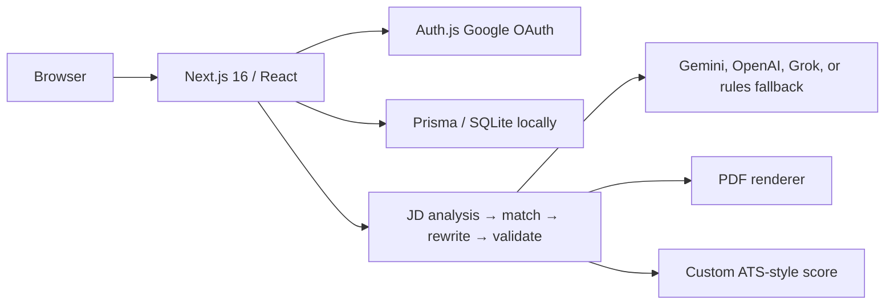

# ATSWeave

ATSWeave helps people build a resume, compare it with a job description, and export a text-based PDF. Tailoring a resume is useful only when it keeps the candidate's real experience intact, so the rewrite pipeline validates generated content against the source profile.

## Implemented features

- Auth.js Google OAuth, with an optional local demo-login setting.
- Prisma-backed profiles, resume templates, edits, saved versions, and generation jobs.
- Job-description analysis, keyword matching, AI-assisted rewriting, and a validation pass intended to reject unsupported claims.
- A local rules-based provider when no AI key is configured. Its output is **not** from Gemini or another live language model.
- A custom ATS-style score and public PDF/text checker. This score is an in-app heuristic, **not** an official score from a commercial applicant tracking system.
- In-process PDF rendering and export. Redis/BullMQ components exist, but the generation route currently starts work inside the web process; reliable durable background processing still needs deployment work.

## Architecture and stack



TypeScript, Tailwind CSS 4, Prisma 6, Auth.js, and React PDF support the app. The connected pipeline is in `src/lib/ai/pipeline.ts`; AI provider selection is in `src/lib/ai/index.ts`.

## Local setup

Use Node.js 20+, npm, and SQLite. Copy `.env.example` to `.env`. Set `AUTH_SECRET` to a fresh random value and configure Google OAuth (`AUTH_GOOGLE_ID`, `AUTH_GOOGLE_SECRET`) for real sign-in. Its local callback is `http://localhost:3000/api/auth/callback/google`. `AUTH_DEMO_LOGIN=true` is for local demonstrations only. Set `AI_PROVIDER=gemini` and `GEMINI_API_KEY` for Gemini; an empty key selects the rules-based fallback.

```bash
npm ci
npm run setup
npm run dev
```

`npm run setup` creates/updates the local schema and seeds templates. It changes the configured local database; review `DATABASE_URL` before running it. `npm run db:reset` is destructive and is not needed for normal setup.

## Environment and integrations

`.env.example` documents `DATABASE_URL`, `AUTH_SECRET`, `AUTH_URL`, Google OAuth fields, optional Gemini/OpenAI/Grok keys, AI limits, `NEXT_PUBLIC_SITE_URL`, and optional `REDIS_URL`. Keep credentials in local or host secrets, never in Git. The included Docker Compose file provides optional local Postgres, Redis, and LaTeX services with demonstration credentials; do not expose those credentials or ports publicly.

## Validation and deployment

```bash
npx prisma validate
npm run db:generate
npx tsc --noEmit
npm run lint
npm run verify
npm run build
```

`npm run verify` exercises the resume pipeline without calling a paid provider when the mock provider is selected. For deployment, use persistent storage, production OAuth redirect URLs, server-side secret configuration, and a database supported by the Prisma schema. The checked-in schema uses SQLite; moving to Postgres requires a reviewed schema and migration. In-process jobs and local rate limiting need hardening before multi-instance or serverless production use.

## Attribution and licensing

Several bundled resume layouts derive from or reference external template projects. Their source URLs remain in the catalog and their license copies and credits are in [THIRD_PARTY_NOTICES.md](THIRD_PARTY_NOTICES.md). The nine original static PNG thumbnails are excluded because their image and depicted personal-data rights could not be verified. Template cards render previews from the application using sample data; a neutral SVG is used for metadata. The maintainer confirmed publication rights for the application source. This local snapshot has no source Git history or root license file, and no exclusive license is asserted over third-party materials.

Repository: [Gaurav598/ATSWeave-AI-Resume-Optimization](https://github.com/Gaurav598/ATSWeave-AI-Resume-Optimization)
